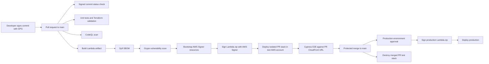

# Security and Supply Chain Flow

This project uses a staged delivery path so changes are tested in an isolated AWS test environment before production.



## Detection and Mitigation Points

- **Developer workstation:** GPG commit signing proves commits came from a trusted key.
- **GitHub branch protection:** require signed commits, the `Verify Signed Commits` status check, CodeQL, SBOM/Grype, tests, and Cypress before merging.
- **CodeQL:** scans Python and JavaScript on pull requests, pushes to `main`, and monthly on a schedule.
- **Syft SBOM:** records the backend deployment artifact contents.
- **Grype:** scans the SBOM and fails the build for High or Critical dependency vulnerabilities.
- **AWS Signer and Lambda code signing:** signed Lambda artifacts are required before Lambda accepts deployments.
- **Per-PR AWS test stack:** each pull request deploys its own resources using the PR number in the Terraform state key and resource environment name.
- **Production environment approval:** GitHub Environment protection can require manual approval before production deployment.

## Remaining Risks

- The PagerDuty key was previously present in `Infra/terraform.tfvars`; rotate it and remove it from git history before making the repository public.
- GitHub branch protection and environment reviewers are configured in GitHub settings, not in this repository.
- GitHub CodeQL can upload findings automatically, but blocking merges on High or Critical code scanning alerts must be enabled with repository rulesets or branch protection.
- The workflow relies on OIDC IAM roles. Those roles should use least privilege and trust only this repository and expected branches/events.
- The test and production AWS accounts should have separate state buckets, lock tables, budgets, and IAM roles.
- For a sensitive or multi-collaborator project, add SLSA provenance attestations, pin third-party GitHub Actions to commit SHAs, use Dependabot, require two-person production approval, and add automated secret scanning.

## GitHub Settings Checklist

- Enable **Require signed commits** on the protected `main` branch.
- Require these status checks before merge:
  - `Verify Signed Commits`
  - `Validate Code and IaC`
  - `SBOM and Dependency Vulnerability Scan`
  - `CodeQL Analyze`
  - `Cypress Test Environment E2E`
- Enable code scanning merge protection for alerts at severity **High** or higher.
- Create a `production` GitHub Environment and add required reviewers for manual approval.
- Add repository variables: `AWS_REGION`, `BUCKET_NAME`, `DOMAIN_NAME`, `ROUTE53_ZONE_ID`, `ALERT_EMAIL`, `PAGERDUTY_URL`, `TEST_TF_STATE_BUCKET`, `TEST_TF_LOCK_TABLE`, `PROD_TF_STATE_BUCKET`, `PROD_TF_LOCK_TABLE`.
- Add repository secrets: `TEST_AWS_ROLE_ARN`, `PROD_AWS_ROLE_ARN`, `PAGERDUTY_INTEGRATION_KEY`.

## Local GPG Commit Signing

```bash
gpg --full-generate-key
gpg --list-secret-keys --keyid-format=long
gpg --armor --export YOUR_KEY_ID
git config --global user.signingkey YOUR_KEY_ID
git config --global commit.gpgsign true
git config --global tag.gpgsign true
```

Add the exported public key to GitHub under **Settings > SSH and GPG keys**. Your commits should show the GitHub **Verified** badge after that.
